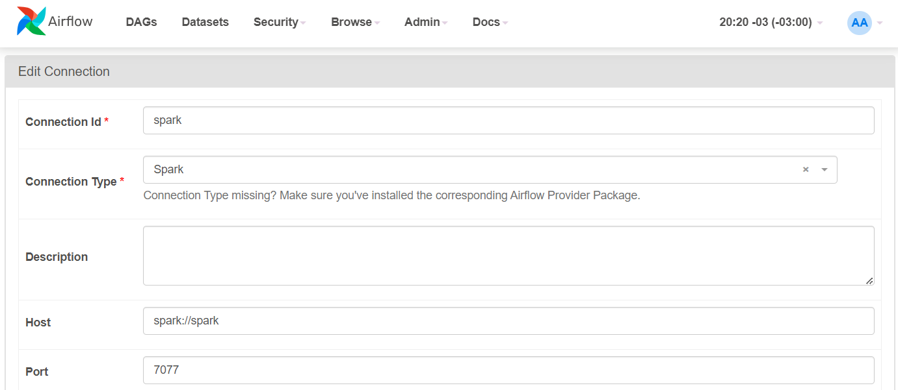

# docker-airflow-spark-playground
Docker with Airflow + Postgres + Spark cluster + JDK (spark-submit support) + Jupyter Notebooks

## 📦 The Containers

* **airflow-webserver**: Airflow webserver and scheduler, with spark-submit support.
    * image: docker-airflow2:latest (custom, Airflow version 2.2.4)
    * port: 8082

* **postgres**: Postgres database, used by Airflow.
    * image: postgres:13.6
    * port: 5432

* **spark-master**: Spark Master.
    * image: bitnami/spark:3.2.1
    * port: 8081

* **spark-worker[-N]**: Spark workers (default number: 1). Modify docker-compose.yml file to add more.
    * image: bitnami/spark:3.2.1

* **jupyter-spark**: Jupyter notebook with pyspark support.
    * image: jupyter/pyspark-notebook:spark-3.2.1
    * port: 8888

## 🛠 Setup

### Clone project
```sh
git clone https://github.com/pyjaime/docker-airflow-spark-playground
```
### Build airflow Docker
```sh
cd docker-airflow-spark-playground/airflow/
```
```sh
docker build --rm -t docker-airflow2:latest .
```


### Launch containers
```sh
cd docker-airflow-spark-playground/
```
```sh
docker-compose -f docker-compose.yml up -d
```

### Check accesses

* Airflow: http://localhost:8082
* Spark Master: http://localhost:8081
* Jupyter Notebook: http://localhost:8888 (follow the instructions to get a token)
  
## 👣 Additional steps
  
### Login airflow
  
* user: airflow@airflow.com
* pass: airflow


### Edit connection from Airflow to Spark

* Go to Airflow UI > Admin > Edit connections
* Edit spark_default entry:
  * Connection Type: Spark
  * Host: spark://spark
  * Port: 7077 

